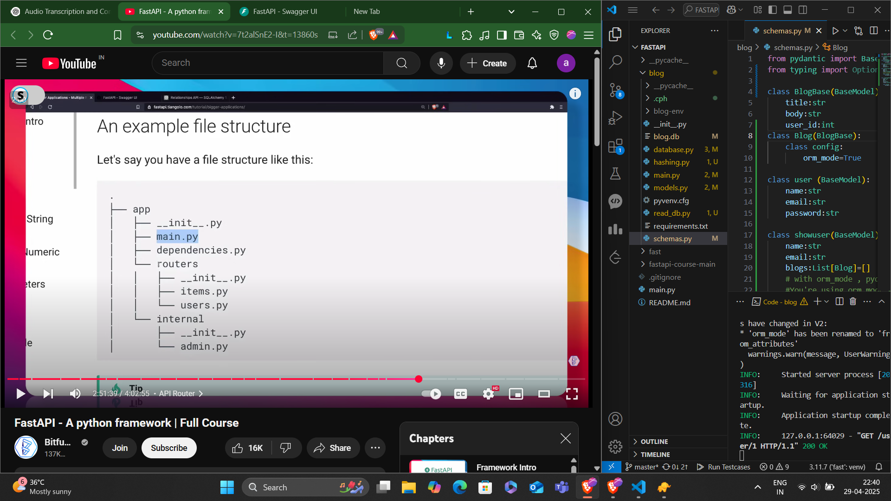
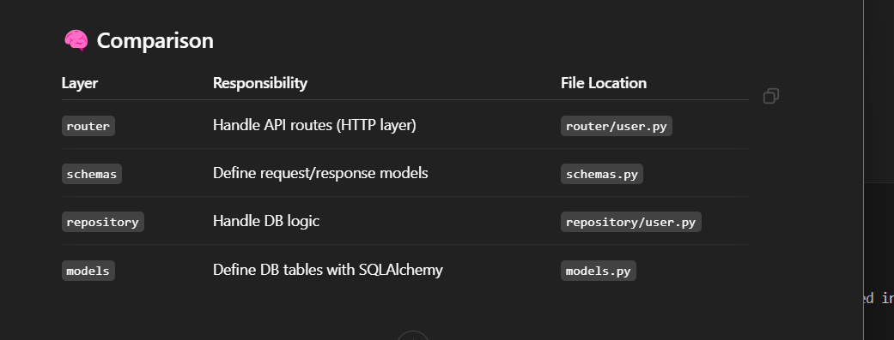

# fastapi
complete tutorial for fast api for beginner

strucure fo file:
alwasy create "__init__.py" so that python can recognise the folder as module

🔁 repository
"Handles database actions like create, read, update, delete (CRUD). It talks directly to the database."

✅ Example: create_user(), get_blog_by_id() — all live here.

🔀 router
"Handles API routes — what should happen when a URL is called (like GET /users)."

✅ Example: When someone visits /users, this tells what response to give.

🧱 models.py
"Defines the structure of your database tables using SQLAlchemy."

✅ Example: A User table with id, name, email columns is defined here.

📦 schemas.py
"Defines how data should look when it comes in or goes out of the API."

✅ Example: When creating a user, what fields are required (like name, email).

🔐 What is JWT?
JWT (JSON Web Token) is a compact, URL-safe token that is used to securely transmit information between parties, often for authentication and authorization in web apps and APIs.

✅ Why do we use JWT?
✅ To verify identity: "Is this user really who they say they are?"

✅ To avoid storing session state on the server — JWT is stateless

✅ To protect routes (like /admin, /dashboard) based on user's role or ID

✅ To allow secure communication between frontend ↔ backend

🔑 How JWT Helps in an App
When a user logs in:

    Server checks credentials

    If valid, it generates a JWT that contains user info (user_id, email, role)

    The client stores this JWT (usually in localStorage or cookie)

    For future API calls, the client sends the JWT in Authorization header

    Server decodes the JWT, checks it's valid and not expired, and lets the request through

🧱 Structure of a JWT
JWT is made of 3 parts (separated by .):

### 🧱 JWT Structure: `xxxxx.yyyyy.zzzzz`

| **Part**     | **What it is**         | **Purpose**                          |
|--------------|------------------------|--------------------------------------|
| **Header**   | Algorithm info         | e.g., `HS256`                        |
| **Payload**  | Data (claims)          | e.g., `{"user_id": 123}`             |
| **Signature**| Security hash          | Prevents tampering                   |

def create_access_token(data: dict, expires_delta: timedelta | None = None):
    to_encode = data.copy()
    expire = datetime.now(timezone.utc) + timedelta(minutes=15)
    to_encode.update({"exp": expire})
    encoded_jwt = jwt.encode(to_encode, SECRET_KEY, algorithm=ALGORITHM)
    return encoded_jwt

### 🧠 JWT Token Generation Code Explanation

| **Line**                  | **Purpose**                                      |
|---------------------------|--------------------------------------------------|
| `data.copy()`             | Copy user info (like email/id) into a new dict   |
| `expire = ...`            | Set the expiration time for the token            |
| `to_encode.update(...)`   | Add `exp` claim into the payload                 |
| `jwt.encode(...)`         | Create the actual JWT string                     |
| `return encoded_jwt`      | Send the token back to the user                  |

Bearer means "I'm holding a token — trust it!"

Are There Other Token Types?
Yes! Some other types:

### 🛡 Token Types in APIs

| Token Type        | Purpose                                                         |
|-------------------|-----------------------------------------------------------------|
| **Bearer**        | Commonly used for JWT authentication in HTTP `Authorization` header |
| **OAuth Tokens**  | Used in third-party logins like Google, GitHub                 |
| **API Keys**      | Simple static keys to access APIs (often used in public APIs)  |
| **Session Tokens**| Stored on the server, unlike JWTs (requires session storage)   |
| **Refresh Tokens**| Used to get a new access token after the current one expires   |

<b>Complete flow of Flow of JWT Authentication</b>

1️⃣ Client sends login request (POST /login) with email & password
      ↓
   - Route: @router.post("/login") in `router/auth.py`
   - Uses: OAuth2PasswordRequestForm → extracts `username` and `password`
   - Example:
       request: OAuth2PasswordRequestForm = Depends()

2️⃣ Server checks credentials
      ↓
   - DB query: db.query(User).filter(User.email == request.username).first()
   - Password verification:
       hashing.verify(user.password, request.password)
   - If any of these fail → raise HTTPException with 401/404

3️⃣ Calls create_access_token() to generate JWT
      ↓
   - Location: `token.py`
   - Function:
       def create_access_token(data: dict):
           ...
           encoded_jwt = jwt.encode(to_encode, SECRET_KEY, algorithm=ALGORITHM)
           return encoded_jwt
   - Data payload passed: {"sub": user.email}
   - Expiry is added: `exp` field in token payload

4️⃣ Server sends JWT to client
      ↓
   - Response format:
       return {
           "access_token": access_token,
           "token_type": "bearer"
       }
   - Client receives token and stores it (usually in `localStorage` or a secure `HttpOnly` cookie)

5️⃣ Client stores JWT and uses it in future requests
      ↓
   - Token is sent in headers of API requests:
       Authorization: Bearer <JWT>
   - This is required to access **protected routes**

6️⃣ For protected routes, FastAPI uses:
       get_current_user()
         → oauth2_scheme (gets token from header)
         → verify_token() (decodes and checks token)
      ↓
   - `get_current_user()` is in `oauth2.py`
     def get_current_user(data: str = Depends(oauth2_scheme)):
         ...
         return token.verify_token(data, credentials_exception)

   - `oauth2_scheme`:
       OAuth2PasswordBearer(tokenUrl="login")
       → Extracts the token automatically from the `Authorization` header

   - `verify_token()` (in `token.py`):
       payload = jwt.decode(token, SECRET_KEY, algorithms=[ALGORITHM])
       email = payload.get("sub")
       if invalid → raise HTTPException

   - This user is passed to your route:
       current_user: schemas.User = Depends(get_current_user)

✅ Result:
   - If token is valid → request proceeds
   - If token is invalid or expired → 401 Unauthorized returned
